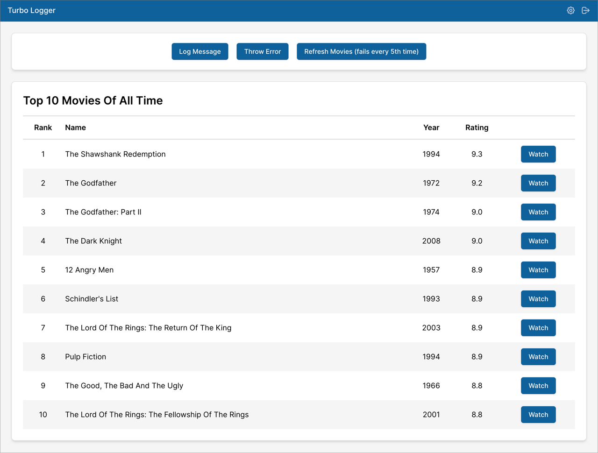
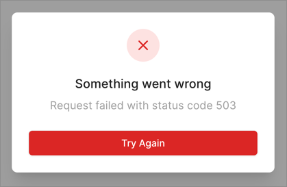
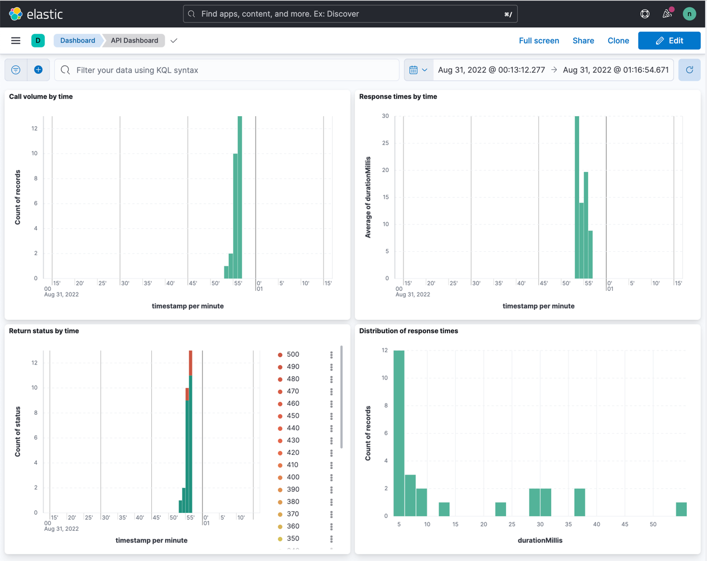
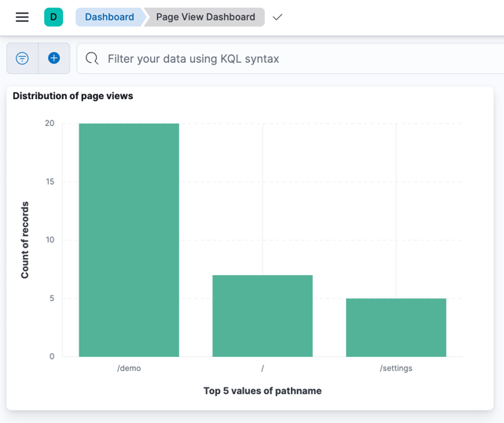
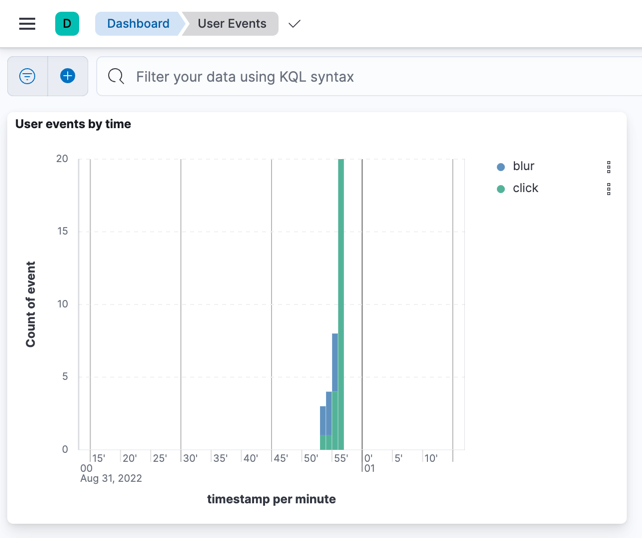

# Turbo Logger

Turbo Logger is a library for instrumenting your web apps to log messages to a
server. What can you do with that?

1. Analyze user actions (sign in, sign out, button clicks, page navigations,
   etc.)
2. Monitor API calls and response times
3. Diagnose uncaught exceptions

Turbo Logger itself is a TypeScript library that is agnostic of the front-end
framework. We have given an example of integrating it with React.

## Features

- 5 log levels: trace, debug, info, warn, error
- Typesafe data structures using TypeScript discriminated unions
- Batch uploads for efficient network and server usage
- Integrations:
  - [react-router](https://reactrouter.com/): to log page views
  - [react-error-boundary](https://github.com/bvaughn/react-error-boundary): to
    log uncaught errors in the React component tree. A fallback dialog is
    provided to alert the user and retry the operation.
  - [useErrorBoundary API](https://tkdodo.eu/blog/react-query-error-handling#error-boundaries):
    to catch errors for event handlers and asynchronous code, because error
    boundaries in React do not catch these errors (this hook is provided by
    React Query )
  - [clientjs](http://clientjs.org/): to provide device fingerprints in the logs

## Log Types

Following Log types are available out of the box:

- ApiCallLog: call to an API
- MessageLog: a general message
- PageViewLog: navigation to a new page
- SignInErrorLog: failed sign-in attempt
- SignInLog: successful sign-in
- SignOutLog: sign out
- UiElementEventLog: event produced by a UI element
- UncaughtErrorLog: uncaught error

For further details, see [Log.ts](packages/logger/src/Log.ts) and the
[Logger API](packages/logger/src/Logger.ts).

## Example Log

```json
[
  {
    "timestamp": "2022-09-01T22:26:36.265Z",
    "level": "info",
    "appId": "turbo-logger-demo",
    "sessionId": "591c2c8c-cf12-493c-817c-577a670db417",
    "environment": "development",
    "userId": "unknown",
    "fingerprint": {
      "browser": "Chrome",
      "browserVersion": "104.0.0.0",
      "os": "Mac OS",
      "osVersion": "10.15.7",
      "screenResolution": "2560x1440",
      "timezone": "-04",
      "language": "en-US"
    },
    "type": "UiElementEvent",
    "event": "blur",
    "container": "SignInPage",
    "elementType": "input",
    "elementId": "password"
  },
  {
    "timestamp": "2022-09-01T22:26:36.382Z",
    "level": "info",
    "appId": "turbo-logger-demo",
    "sessionId": "591c2c8c-cf12-493c-817c-577a670db417",
    "environment": "development",
    "userId": "demo",
    "fingerprint": {
      "browser": "Chrome",
      "browserVersion": "104.0.0.0",
      "os": "Mac OS",
      "osVersion": "10.15.7",
      "screenResolution": "2560x1440",
      "timezone": "-04",
      "language": "en-US"
    },
    "type": "SignIn"
  },
  {
    "timestamp": "2022-09-01T22:26:36.394Z",
    "level": "info",
    "appId": "turbo-logger-demo",
    "sessionId": "591c2c8c-cf12-493c-817c-577a670db417",
    "environment": "development",
    "userId": "demo",
    "fingerprint": {
      "browser": "Chrome",
      "browserVersion": "104.0.0.0",
      "os": "Mac OS",
      "osVersion": "10.15.7",
      "screenResolution": "2560x1440",
      "timezone": "-04",
      "language": "en-US"
    },
    "type": "PageView",
    "pathname": "/demo",
    "url": "http://localhost:3000/demo"
  },
  {
    "timestamp": "2022-09-01T22:26:36.439Z",
    "level": "info",
    "appId": "turbo-logger-demo",
    "sessionId": "591c2c8c-cf12-493c-817c-577a670db417",
    "environment": "development",
    "userId": "demo",
    "fingerprint": {
      "browser": "Chrome",
      "browserVersion": "104.0.0.0",
      "os": "Mac OS",
      "osVersion": "10.15.7",
      "screenResolution": "2560x1440",
      "timezone": "-04",
      "language": "en-US"
    },
    "type": "ApiCall",
    "url": "http://localhost:8000/top-10-movies",
    "method": "get",
    "startTime": "2022-09-01T22:26:36.394Z",
    "endTime": "2022-09-01T22:26:36.438Z",
    "durationMillis": 44,
    "status": 200,
    "statusText": "OK"
  }
]
```

## Concepts

[Logger](packages/logger/src/Logger.ts) is a simple module that collects logs in
an internal buffer. To push a log to the buffer, you must call one of the five
logging methods:

1. Logger.trace()
2. Logger.debug()
3. Logger.info()
4. Logger.warn()
5. Logger.error()

You must periodically retrieve the logs collected in the buffer and clear it.
These two operations are performed using a single call to
`Logger.clearLogBuffer()`. It is your responsibility to then transmit the
retrieved logs to a server using your favorite API (e.g. fetch, axios or
GraphQL). Here's an example of how to do this using axios:

```typescript
/** Sends all the buffered logs to the server */
async function flush() {
  const logBuffer = Logger.clearLogBuffer();
  if (logBuffer.length === 0) {
    return;
  }

  try {
    // Transmit the log buffer
    const resp = await axiosInstance.post('/', logBuffer);
    return resp.data;
  } catch (e) {
    console.log('Error sending logs');
  }
}
```

## Building the Demo App

```shell
# Run ci in the root directory to install dependencies
npm ci

# Run a full build to make sure everything is set up correctly
npm run build

# Run the demo app
npm run dev
```

- Now point your browser to http://localhost:3000/. You will see the demo app as
  shown below.
- Open the Chrome debugger
- Try out the suggested operations to see the logs in the chrome debugger.



> Note: Do not run `npm install` or `npm ci` in any of the subdirectories. It
> will break the build. There should be only one `package-lock.json` file in the
> entire repo (at the root).

## Integrating Turbo Logger with your React App

### Install Turbo Logger

`npm install @turboutils/logger`

### Create a LoggerService

Create a `LoggerService` in your app, similar to the
[LoggerService](apps/turbo-logger-demo/src/services/LoggerService.ts) in the
`turbo-logger-demo` app. The basic function of this service is to flush the logs
periodically to a log server. In this example, we flush the logs every 5
seconds.

Note that the initialization code sets the `appId`, the `sessionId` and the
`environment`. In addition, it sets up axios interceptors to log any API calls
made through axios.

```typescript
function init() {
  Logger.setAppId(appId);
  Logger.setSessionId(sessionId);
  Logger.setEnvironment(environment);

  setupInterceptors(axios);

  // Set interval to flush logs
  window.setInterval(async () => {
    await flush();
  }, flushInterval);
}
```

Also note that the `LoggerService` sets up a separate `axiosInstance` to
transmits the logs. This avoids any interference between the application API
calls and the logger API calls.

### Initialize the LoggerService

Initialize the `LoggerService` as soon as your application starts. See example
[here](apps/turbo-logger-demo/src/main.tsx#L13).

### Add an ErrorBoundary

Add an `ErrorBoundary` at the top of your component tree and use it to show and
log uncaught errors. See an example
[here](apps/turbo-logger-demo/src/main.tsx#L43-L54). A sample
`ErrorFallbackComponent` is provided
[here](apps/turbo-logger-demo/src/components/ErrorFallbackComponent/ErrorFallbackComponent.tsx)
and looks like this:



If you are using [React Query](https://react-query-v3.tanstack.com/) to make API
calls, make sure that you initialize it using the `useErrorBoundary` option (see
[here](apps/turbo-logger-demo/src/main.tsx#L15-L25)). This allows React Query to
leverage the ErrorBoundary when an exception happens.

### Capture Page Navigations

If you use [React Router](https://reactrouter.com/), instrument it to log page
navigations. Use the `usePageViewLog` hook as shown
[here](apps/turbo-logger-demo/src/App.tsx#L12-L29).

### Capture Authentication Logs

Find suitable spots in your application to inject sign in, sign out and
unsuccessful sign in logs. See examples
[here](apps/turbo-logger-demo/src/contexts/AuthStateContext/AuthStateContext.tsx#L30-L44)
and [here](apps/turbo-logger-demo/src/pages/SignInPage/SignInPage.tsx#L34-L37).

### Capture User Interactions

Capture key user interactions, like button clicks or selection changes. You can
see an example
[here](apps/turbo-logger-demo/src/components/MovieList/MovieList.tsx#L10-L19).
For a full list of events refer to the
[Log data structure](packages/logger/src/Log.ts).

## Sample Log Visualizations using Kibana

### API Dashboard



### Page View Dashboard



### User Events Dashboard


